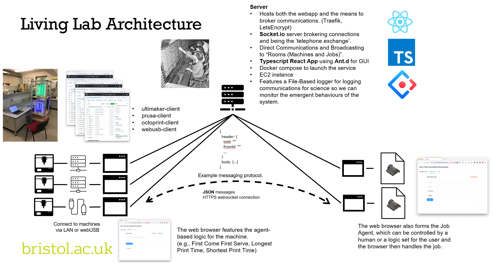
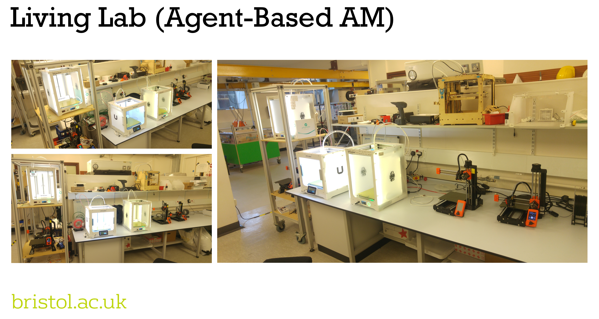

# Brokering Additive Manufacturing Living Lab

The Brokering Additive Manufacturing (BAM) Living Lab is a demonstrator and test bed for agent-based manufacturing research.
It provides the platform that enables 3D printers and jobs to broker connections, negotiate and bid for work.
3D printers and jobs are both agents – self-aware and able to reason – enabling local rather than centralised governance and control of existing approaches.
The approach affords accessibility, inclusivity, responsiveness, and resilience.
Features that are inherently difficult or impossible for conventional approaches to attain.

## Contents

- [How does it work?](#how-does-it-work)
- [Running the service.](#running-the-service)
- [The role of the broker](#the-role-of-the-broker)

## How does it work?

The platform is built using Typescript, is entirely web-based and designed with modularity in mind. The modules include:

- **The Broker**. This handles the communication between Machines and Jobs. This repository.
- **Machine and Job Agents**. These handles the connections and sets the logics for Machines and Jobs to interact with the platform.
- **Machine Clients**. That provide the connections to the different types of 3D printer. We have built clients for Ultimaker, Octoprint and a direct connection via WebUSB.
	- [Ultimaker Client](https://github.com/jamesgopsill/ultimaker-client)
	- [Prusa Client](https://github.com/jamesgopsill/prusa-client)
	- [Octoprint Client](https://github.com/jamesgopsill/octoprint-client)
	- [Web Serial](https://github.com/jamesgopsill/svelte-web-serial)
- **Living Lab Website**. That brings the agent and client modules together so individual can submit Jobs and add their printers to the service.
- **Dummy Machine and Job Agents**. Code that can mimic a job and machine for testing purposes and to create a Digital Twin of the service.

The agent-based manufacturing systems features three types of agent - Machine, Job and Broker.
Machine agents represent the AM machines, Job agents represent the jobs that need to be manufactured, and Broker agents broker connections and communication between the Machine and Job agents.







The Broker permits direct and broadcast (to a population) communication and provides the communication protocol for the platform.
The protocol is detailed as an Typescript interface and details can be viewed in the docs.
An example is shown here:

```
export enum MessageProtocols {
	DIRECT = "direct",
	ALL_MACHINES = "all_machines",
	ALL_JOBS = "all_jobs",
	MESSAGE_ERROR = "message_error",
	CONNECT = "connect",
	CONNECT_ERROR = "connect_error",
	STATS = "stats",
}
```

Within these protocols, one can set up the communications strategy between jobs and machines.
The communication strategy employed exists on a spectrum of brokerage (Figure 4).
On the one end, we have co-ordinated manufacturing where the Machine agents lead on the discussion and make the decisions as to which jobs to manufacture with the Job agents being submissive.
On the other end, we have marketplace manufacturing where the Job agents lead the discussions and make the decisions, and the Machine agents are submissive.
In the middle, exists brokered manufacturing where both Machine and Job agents negotiate and agree upon where they will be manufactured.

## Running the broker.

To run an instance of the broker, first clone this repo onto your device.
One can either use the Command Line Interface (CLI) [In progress], Docker instance or import it into a script.


### Running from a script

An example of a script that instantiates and runs the broker can be found in the `example` folder.
It can be run using the command `pnpm`

```typescript
import { Broker, BrokerConfig } from "@jamesgopsill/bam-living-lab-server"

const config: BrokerConfig = {
	logFolderPath: "",
	accessLogsKey: "",
	socketKey: "",
	debug: false
}

const broker = new Broker(config)

broker.start()
```

### Running using Docker

Please `docker-compose.sample.yml` for a sample docker compose file for running the broker.

## Contributing

We would love to have additional contributors to the project to help us maintain and add functionality to the project.

## Support the Project

The project has been supported by the [EPSRC-funded Brokering Additive Manufacturing project (EP/V05113X/1)](https://gow.epsrc.ukri.org/NGBOViewGrant.aspx?GrantRef=EP/V05113X/1).
More details on the project can be found at the [Design Manufacturing Futures Lab](https://dmf-lab.co.uk/) website.

If you like this project, please consider sponsoring the developers so they can continue to maintain and improve the package.

## Publications

- [J. Gopsill, M. Obi, L. Giunta and M. Goudswaard. “Queueless: Agent-Based Manufacturing for Workshop Production”. Proceedings of the 16th International KES Conference on Agent & Multi-Agent Systems: Technologies & Applications. 2022.](https://link.springer.com/book/9789811933585)
- [M. Goudswaard, J. Gopsill, A. Ma, A. Nassehi, and B. Hicks. “Responding to rapidly changing product demand through a coordinated additive manufacturing production system: a COVID-19 case study”. In: Proceedings of the Manufacturing Engineering Society International Conference. 2021.](https://iopscience.iop.org/article/10.1088/1757-899X/1193/1/012119/meta)

